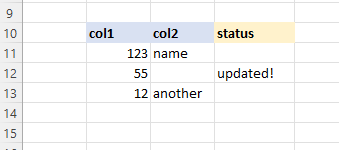

# Responding with Messages
There are numerous ways to return messages to users both at the data row level and the application level. 


<br>
<br>


# User Messages
User Messages can be configured on the response object by calling `InterjectResponseDto.setUserMessage("<STRING>")` before returning the response. This provides a popup in the addin to the user.

```java
// shortened controller code
public ResponseEntity<InterjectResponseDto> testUserMessage() {
    // construct a response
    InterjectResponseDto resp = new InterjectResponseDto();

    // set a user message
    resp.setUserMessage("Please use a different input!!!");

    // post-process response
    resp.prepare();

    // return response (spring framework)
    return ok(resp);
}
```

<br>


<br>
<br>
<br>

# Error Messages
Error Messages can be configured on the response object by calling `InterjectResponseDto.setErrorMessage("<STRING>")` before returning the response. This describes an error in the formula details field of the pull\save window.

```java
// shortened controller code
public ResponseEntity<InterjectResponseDto> testErrorMessage() {
    // construct a response
    InterjectResponseDto resp = new InterjectResponseDto();

    // set a user message
    resp.setErrorMessage("A critical error occured during the query!");

    // post-process response
    resp.prepare();

    // return response (spring framework)
    return ok(resp);
}
```


<br>
<br>
<br>

# Dataportal Formula Parameter Error Messages
Error Messages can also be specified for specific parameters by setting the validation attribute seen below. 

```java
// shortened controller code
public ResponseEntity<InterjectResponseDto> testParamErrorMessage() {
    // construct a response
    InterjectResponseDto resp = new InterjectResponseDto();

    // set a error message for a specific parameter
    interjectRequest.getParam("Param1").setUserValidationMessage("Param1 requires a better input!");

    // add request params to response object
    resp.setRequestParameterList(interjectRequest.getRequestParameterList());

    // post-process response
    resp.prepare();

    // return response (spring framework)
    return ok(resp);
}
```


<br>
<br>
<br>

# ReportSave Result Columns
`ReportSave` has the ability to not only send data from the sheet to a data api or database but also populate the spreadsheet with data returned from the data api or database via the `ResultsRange`. When defined this will populate the columns mentioned with the data returned to interject.


```
// REQUEST TABLE DATA
// data the api gets from excel

TableName:  Table1
  Columns:  Row,  col,  col2,
     Data:  11,   123,  name,
            12,   55,   null,
            13,   12,   another,
```

```java
// DATA API CODE
// this adds a column for status, then updates a row with a status message for the user
InterjectTable table = interjectRequest.getXmlDataToSave();
table.addColumn(new InterjectColumn("status"));
table.update("status", 1, "updated!");
```


```
// RESPONSE TABLE DATA
// data the api sends back to excel

TableName:  Table1
  Columns:  Row,  col,  col2,     status,
     Data:  11,   123,  name,     null,
            12,   55,   null,     updated!,
            13,   12,   another,  null,
```


