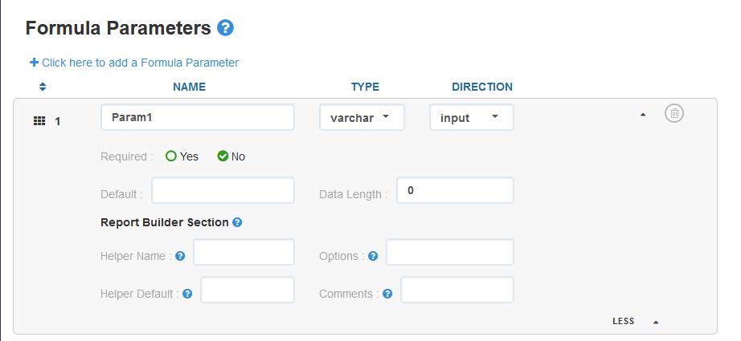

# Dataportal Parameters
Dataportal parameters allow you to get specific data inputs from the spreadsheet through interject.

<br>
<br>


# Formula Params
These are parameters defined and customized by the developer.



<br>

After they are defined in the [Interject Portal Site](https://portal.gointerject.com/), the parameters can be defined in any of the interject excel report formulas (ie ReportRange, ReportSave, ReportVariable, ReportFixed, etc...) by setting `Param(<CELL>, <CELL>, ...)` in the formula's `Parameters`.


<br>

Once the report formulas are configured to use parameters the data api code can get the values from those parameters through the request object.

```java
// this request will come from Spring Framework in the data api
InterjectRequestDto interjectRequest = new interjectRequest();

// get formula parameter object from request
RequestParameter param = interjectRequest.getParam("Param1");

// OR..... get formula parameter values from request
String reportParam1 = interjectRequest.getParamValue("Param1");
Integer reportParam2 =  interjectRequest.getParamValueInt("Param2");
Float reportParam3 =  interjectRequest.getParamValueFloat("Param3");
```


<br>
<br>
<br>


# System Params
These are parameters defined by Interject but can be included in any dataportal and will be included in the `InterjectRequestDto.RequestParameterList`. Once configured in the [Interject Portal Site](https://portal.gointerject.com/) they will be passed to the data api or database from excel and can be parsed out similar to formula parameters.


<br>

Below are the currently handled system param methods on the interjectRequest object.

```java
// this request will come from Spring Framework in the data api
InterjectRequestDto interjectRequest = new interjectRequest();


// Currently handled getters for system params
InterjectRequestContext requestContext = interjectRequest.getRequestContext();
List<InterjectRowColItem> rowDefItems = interjectRequest.getRowDefItems();
List<InterjectRowColItem> colDefItems = interjectRequest.getColDefItems();
InterjectTable table = interjectRequest.getXmlDataToSave();
String excelVersion = interjectRequest.getExcelVersion();
String userID = interjectRequest.getUserID();
String clientID = interjectRequest.getClientID();
String loginName = interjectRequest.getLoginName();


// SYSTEM PARAMS CURRENTLY NOT HANDLED
interjectRequest.getNTLogin();
interjectRequest.getUserRoles();
interjectRequest.getSourceFileAndPath();
interjectRequest.getSourceFilePathAndTab();
interjectRequest.getLocalTimeZoneOffset();
```
