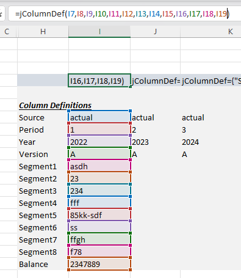

# Working with the `jColumnDef` Formula 
The `jColumnDef` formula can be used to get extra details about a column such as source, year or custom defined segments for accounting purposes. The example below shows how to configue the spreadsheet report with the formula and how to access the data the formula provides from the data api side.

<br>
<br>

# The Report



<br>
<br>

# The Dataportal
With the report configured, now we need to make sure the dataportal on the [interject customer portal site](https://portal.gointerject.com/DataPortals.html) includes either the system parameter, `Interject_ColDefItems` or `Interject_RequestContext`.


<br>
<br>

# The Data API
From the data api side, Column Definition Items can be accessed from the request object with, `InterjectRequest.getColDefItems()`. This will yield a list of `InterjectRowColItem` that represent each column with an entry specified in the `ColDefRange` of the `ReportVariable` formula or any other `Report<NAME>` formula.

To access the column attributes from the `jColumnDef` formula, access variables in the `InterjectRowColItem,Json` hashmap as shown below with `item.getJson().get("<KEY>")`. All available keys are show below in the json object.

```java
// how to iterate over column def items and get jColumnDef attributes
List<InterjectRowColItem> colDefItems = interjectRequest.getColDefItems();
for (InterjectRowColItem item: colDefItems){
    System.out.println(item.toString();
    String period = item.getJson().get("P");
}
```


```jsonc
// json data stored in InterjectRowColItem.Json hashmap
{
    "S":"actual", 
    "P":"1", 
    "Y":"2022", 
    "V":"A", 
    "S1":"asdh", 
    "S2":"23",
    "S3":"234", 
    "S4":"fff", 
    "S5":"85kk-sdf", 
    "S6":"ss", 
    "S7":"ffgh", 
    "S8":"f78", 
    "B":"2347889"
}
```