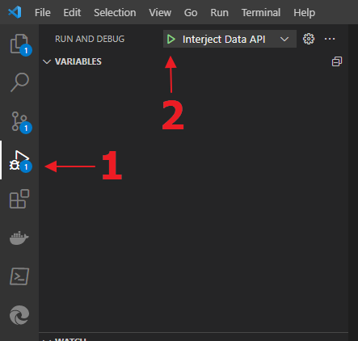

# Interject Dotnet Data Api

### A Dotnet version of the Data Api used to connect Interject to your data sources. This can be deployed within a client's network behind a firewall. Or it can be made public as client needs vary.

---

- ### **[How to setup the API for development](#setup-for-dev)**
- ### **[How to add a new controller](#new-controller)**
- ### **[Working with the request pipeline](#request-pipeline)**
- ### **[Status controller](#status-controller)**
- ### **[App Settings](#app-settings)**

# <a name="setup-for-dev">How to setup the API for development</a>

Steps: _using Visual Studio Code_

1. Clone the repo.
2. You will need to install the dotnet 6 sdk.
3. You will also need the dotnet C# extension for VSCode. It's listed in the .vscode extensions.json file.
4. Navigate to the interject-dotnet-api directory and execute the restore command.
   > dotnet restore
5. You should now be able to now run the application. Press (Ctrl+Shift+D) or use the run and debug menu.

   

   - To run Without debugging Pres F5 or enter the command:
     > dotnet run

6. This should use Kestrel to serve the application locally at http://localhost:5000
7. You can test by sending a request to the status controller http://localhost:5000/api/v1/status

# <a name="new-controller">How to add a new controller</a>

Each controller will likely represent either a connection to a particular type of data source or a logical collection of endpoints for a series of reports. Each endpoint should follow the basic pipeline flow for handling a request. See [Working with the request pipeline](#request-pipeline) for more details.

Using the first example there is an SQLController included in this project already. Here is how to create a new controller template. This will create the controller with one endpoint, and three classes; one for each of the required interfaces.

1. Create a new file in the Controllers directory using the naming convention {Name}Controller.cs.
2. Use code snippets to scaffold the controller. The prefix is 'contr'.
   > contr > TAB
3. Type the {Name} of the controller as prompted by the snippet and press TAB
4. You can now begin to customize your Pipeline interface implementations.

  

# <a name="request-pipeline">Working with the request pipeline</a>

The _**InterjectRequestHandler**_ creates a pipeline for processing the _**InterjectRequest**_ object sent from the Interject Addin. This class contains a few properties that are intended for use as the request passes through the phases of the request pipeline. The pipeline uses Dependency Injection to consume classes derived from interfaces. It passes itself as a parameter to each of the interface's methods to expose access to the rest of the class. Those phases and interfaces are as follows:

1. Initialize the _**InterjectRequestHandler**_
2. Convert the _**RequestParameters**_ _(IParameterConverter)_
3. Fetch the data _(IDataConnection)_
4. Convert the data _(IResponseConverter)_
5. Return the _**InterjectResponse**_ object

## 1) **Initialize the InterjectRequestHandler**

Create an instance of the **InterjectRequestHandler** passing the InterjectRequest into the constructor. This will instantiate a new _**InterjectResponse**_ object and store the _**InterjectRequst**_. The constructor will also instantiate a couple other data storage properties described below for use in the rest of the pipeline. The inital _**InterjectRequset.RequestParameterList**_ is also transferd to the _**InterjectResponse.RequestParameterList**_ to ensure the Addin at least recieves the original parameters in the response. It is also possible to replace or manipulate those returned parameters during the pipeline if needed.

## 2) **Convert the RequestParameters** _(IParameterConverter)_

The data source you are creating the controller for will likely need the parameters passed in the request to be either converted to another class type or be otherwise processed before they can be used to fetch the data.

The _**InterjectRequestHandler.ConvertedParameters**_ property is a collection of generic object type intended for storing the processed parameters to be used in the next phase. Since the collection is a list of generic object you can place a collection of any type needed.

## 3) **Fetch the data** _(IDataConnection)_

The Interface requires an implementation of both a sync and async fetch method. However, which you choose to use in the controller's endpoint is up to you.

The data returned is intended to be stored in the _**InterjectRequestHandler.ReturnData**_ property until the _**IResponseConverter**_ derived class can transfom it to the collection of _**ReturnedData**_ in the _**InterjectRequestHandler.InterjectResponse**_.

## 4) **Convert the data** _(IResponseConverter)_

Once the data has bee returned from the data source, it needs to be converted into the form the Interject Addin can consume. See the _**InterjectResponse.ReturnedDataList**_ property for a definition of the required form.

## 5) **Return the InterjectResponse object**

For reverse compatiblilty reasons, the _**ReturnedData.Data**_ property must be serialized prior to retuning the response to the caller. The _**InterjectRequestHandler.PackagedResponse**_ property handles this to make it easier for development.

# <a name="status-controller">Status Controller</a>

As an additional tool for testing and to assist in future troubleshooting of client APIs, a status controller is available. There are two endpoints. One is just to check if the api is running and can be reached at {base url}/api/v1/status. The other is to check the installed version and obtain any other information stored in the appsettings.json > app property. This one can be reached at {base url}/api/v1/status/info.

Neither of these endpoints are secured.

# <a name="app-settings">App Settings</a>

This API uses appsettings.json and two classes that implement the options pattern to strongly type two of the members of the settings json.

The two options classes are _**ApplicationOptions**_ and _**ConnectionStringOptions**_.

_**ApplicationOptions**_ contains the name of the data api which will let us know language and framework information. It also contains the version of the API installed to make it easier during support calls. The version correlates directly to the tag on the main branch of the repo.

_**ConnectionStringOptions**_ is used by the _**SQLController**_ where connection strings can be stored locally on the client's environment. This is referenced by the _**InterjectRequestHandler.ResolvConnectionString()**_ method during initialization of the request pipeline.
