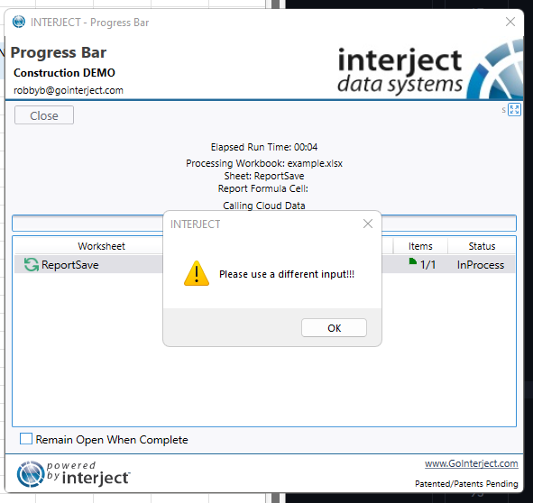
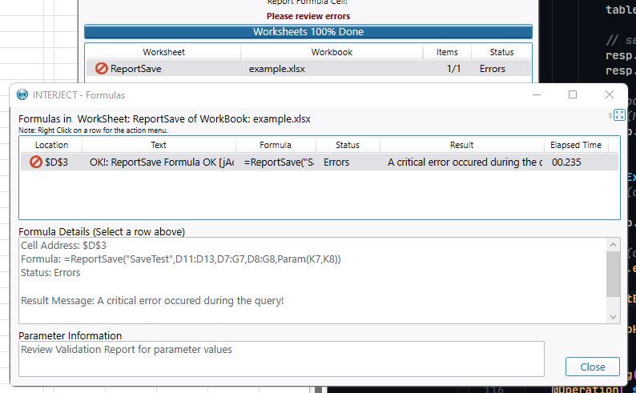
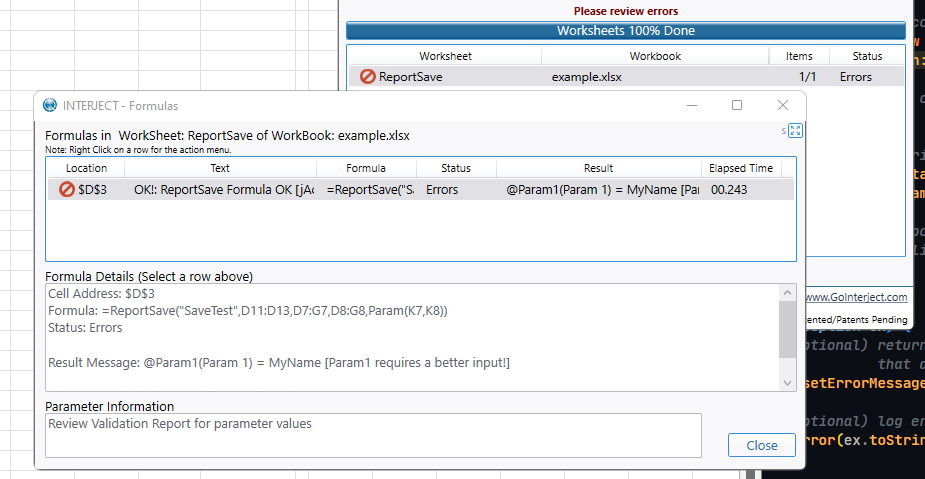
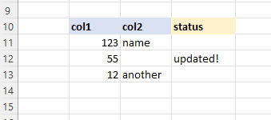

# Responding with Messages

There are numerous ways to return messages to users both at the data row level and the application level.

## User Messages

User Messages can be configured on the response object by setting the `UserMessage` property of the `InterjectResponse` object before returning the response. This provides a popup in the addin to the user.

```csharp
using Interject.Api;

// construct a response
InterjectResponse response = new(interjectRequest);

// set a user message
response.UserMessage ="Please use a different input!!!";

// return response
return response;
```

<br>

<br>
<br>

## Error Messages

Error Messages can be configured on the response object by setting the `ErrorMessage` property of the `InterjectResponse` object before returning the response. This describes an error in the formula details field of the pull\save window.

```csharp
using Interject.Api;

// construct a response
InterjectResponse response = new(interjectRequest);

// set a user message
response.ErrorMessage ="A critical error occured during the query!";

// return response
return response;
```

<br>

<br>
<br>

## Data Portal Formula Parameter Error Messages

Error Messages can also be specified for specific parameters by setting the validation attribute seen below.

```csharp
using Interject.Api;

// construct a response
InterjectResponse response = new(interjectRequest);

// set a error message for a specific parameter
interjectRequest.GetParameter("Param1").UserValidationMessage = "Param1 requires a better input!";

// return response
return response;
```

<br>

<br>
<br>

## ReportSave Result Columns

The `ReportSave` function has the ability to send data from the sheet to a data api or database. In addition, this function also can populate the spreadsheet with data returned from the data api or database via the `ResultsRange`. When this parameter is defined in the Excel report, the columns included in this range will be populated with the corresponding columns in the data returned to interject.

**Example Data Sent To the API From Interject**
<br>

```
// data the api gets from excel

TableName:  Table1
  Columns:  Row,  col,  col2,
     Data:  11,   123,  name,
            12,   55,   null,
            13,   12,   another,
```

**Add A Status Column and Set the Data**
<br>

```csharp
using Interject.Api;

// this adds a column for status, then updates a row with a status message for the user
IdsTable table = requestContext.XmlDataToSave;
table.AddColumn(new("Status"));
table.Update("Status", 1, "Updated!");
```

**Example Data Sent Back To Interject From the API**
<br>

```
// data the api sends back to excel

TableName:  Table1
  Columns:  Row,  col,  col2,     status,
     Data:  11,   123,  name,     null,
            12,   55,   null,     updated!,
            13,   12,   another,  null,
```

**What Is Displayed in the Report**
<br>


