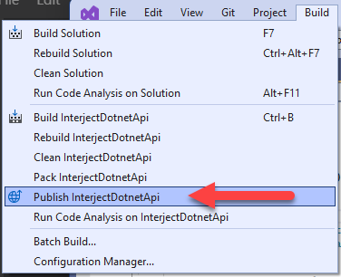
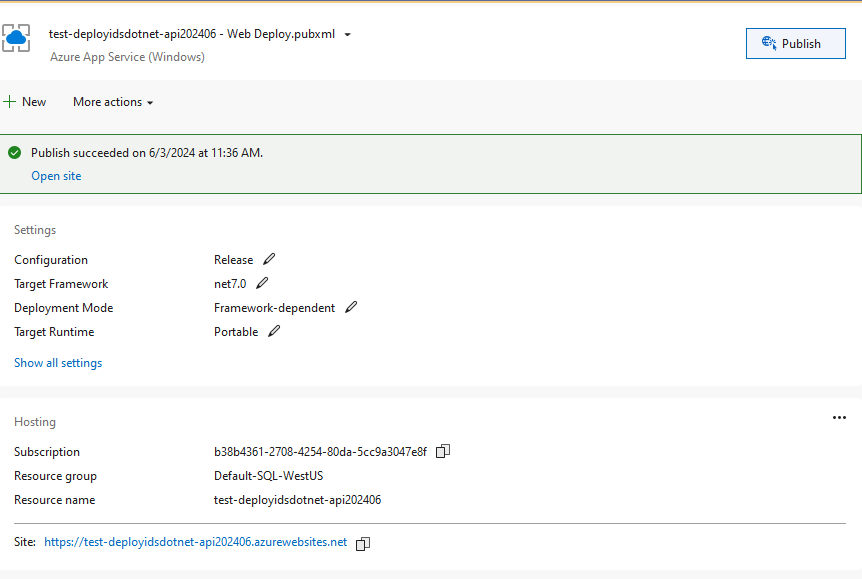
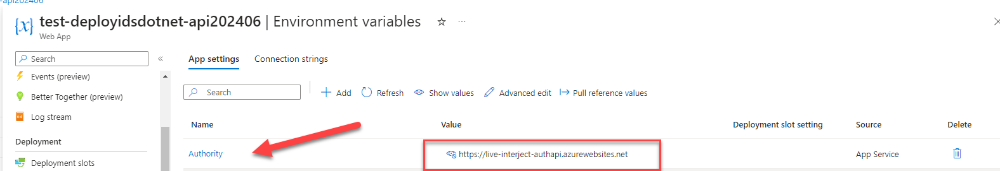
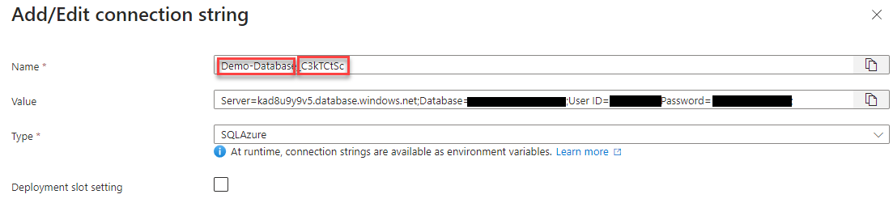
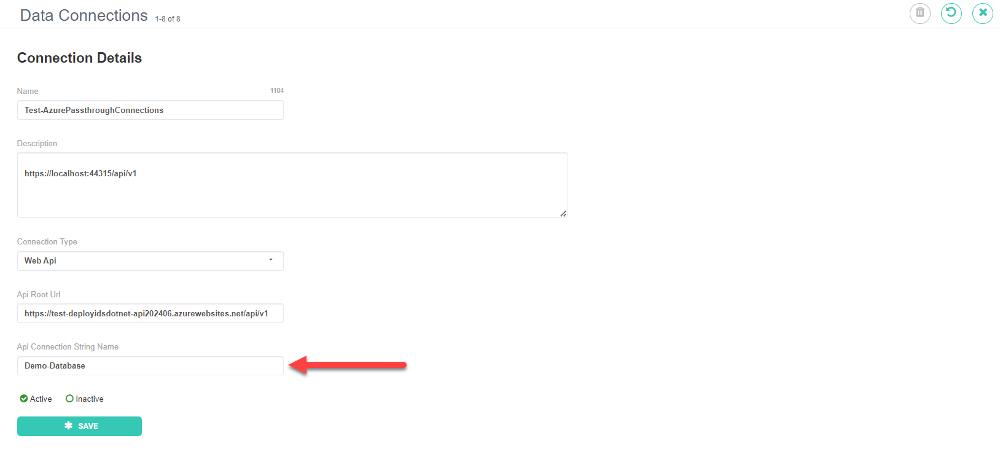
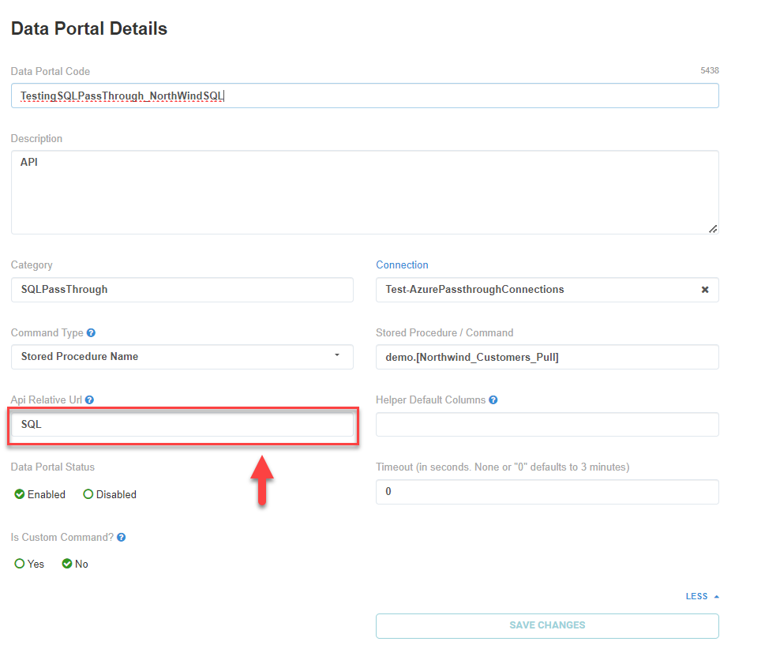

# How to Deploy Project Using Visual Studio

1. Go to folder `./ids-dotnet-api/interject.data.api/interject.data.api/` and open project using Visual Studio `InterjectDotnetApi.csproj`

2. Build project

3. Publish Project

   
   <br>

4. Add configuration to Azure

   
   <br>

5. Setup App setting in Azure

   - Name: Authority
   - Value: https://live-interject-authapi.azurewebsites.net

     
     <br>

6. Add connection strings using the following

   - Add connection Name: `{ConnectionName}_{ClientPublicID}`
   - Connection String:

     
     <br>

7. Reset site to include changes made to connection strings and web app settings

8. Confirm that site is up (you may need to start the site)

```
https://{subUrl}.azurewebsites.net/api/v1/status
```

# How to Set Up A Data Connection on the Interject Data Portal Site

1. Setup the connection in the portal site to match the config Connection String

   
   <br>

2. Create a Data Port

   
   <br>
