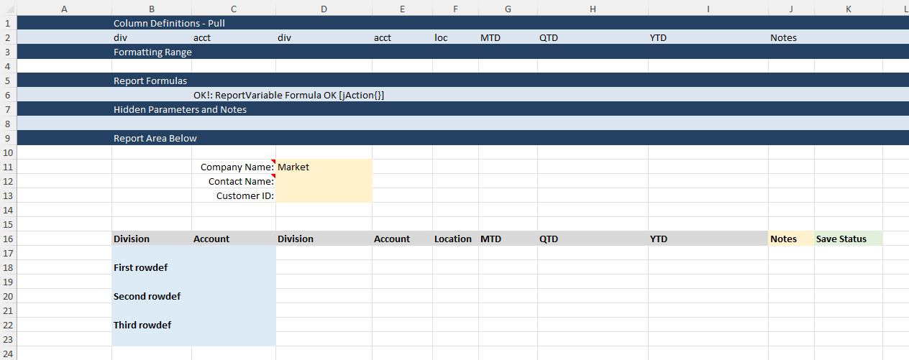

# Multi-Col RowDef Items

The [RowDefRange](https://docs.gointerject.com/wIndex/ReportVariable.html#function-arguments) parameter defines a range of RowDefItems. The RowDefItems define where to map the data being returned to Interject from the API for a [ReportFixed](https://docs.gointerject.com/wIndex/ReportFixed.html) or [ReportVariable](https://docs.gointerject.com/wIndex/ReportVariable.html).

Starting with Interject ver 2.5x, this RowDefRange can be a multi-column range. In this case, the combination of column values provide a unique _key_ for matching up the data.

## RowDef Items

The RowDef Items are packaged as XML by Interject and parsed in the object `InterjectRequestContext.RowDefItems`. In order for Interject to match up the data for these RowDef Items, there needs to be a column returned from the API called "RowDefName." If the data source does not return a column called "RowDefName", Interject will use the value defined in the Column Definition range in the same column as the RowDef Items.

## Example 1 - Multiple Column RowDefRange

### The Report

The following is an Excel report that shows multiple columns in the RowDefRange. Note the columns "div" and "loc" are the 2 columns that constitute the RowDefRange. In order to process the data to be returned to this report, the columns need to have matching names in the IDS Table ("div" and "loc").

_\* This report can be found in the example.xlsx report in the `examples` folder._


<br>
<br>

### Code

```csharp
        [HttpPost("ReportVariable")]
        [ProducesResponseType(typeof(InterjectResponse), 200)]
        public InterjectResponse TestReportVariable([FromBody] InterjectRequest interjectRequest)
        {
            // Create an instance of the InterjectResponse to return by passing in the
            // InterjectRequest from the request. This copies the parameter list from
            // the request into the response.
            InterjectResponse response = new(interjectRequest);

            var requestContext = interjectRequest.GetRequestContext();

            try
            {
                // (Optional) Get DataPortal formula parameter values.
                string reportParam1 = interjectRequest.GetParameterValue<string>("CompanyName");
                string reportParam2 = interjectRequest.GetParameterValue<string>("ContactName");
                string reportParam3 = interjectRequest.GetParameterValue<string>("CustomerID");

                // (Optional) Process Column Definition Items.
                List<InterjectColDefItem> colDefItems = interjectRequest.GetColDefItems();
                colDefItems.ForEach(item =>
                {
                    Console.WriteLine(item.ToXML());
                });

                // (Optional) Process Row Definition Items.
                List<InterjectRowDefItem> rowDefItems = interjectRequest.GetRowDefItems();
                rowDefItems.ForEach(item =>
                {
                    Console.WriteLine(item.ToXML());
                });

                foreach (InterjectColDefItem item in colDefItems)
                {
                    Console.Write(item.ToString());
                }

                // Assemble data to return to Interject to be populated on the spreadsheet.
                IdsTable table = new();
                table.AddColumn(new("div"));
                table.AddColumn(new("loc"));
                table.AddColumn(new("acct"));
                table.AddColumn(new("MTD"));
                table.AddColumn(new("QTD"));
                table.AddColumn(new("YTD"));
                table.AddRow(new() { "701", "123", "3333", "94.30", "904.34", "9804.34" });
                table.AddRow(new() { "701", "123", "3334", "94.31", "904.34", "9804.34" });
                table.AddRow(new() { "701", "124", "3334", "94.32", "904.34", "9804.34" });
                table.AddRow(new() { "701", "124", "3334", "94.33", "904.34", "9804.34" });
                table.AddRow(new() { "701", "124", "3335", "94.34", "904.34", "9804.34" });
                table.AddRow(new() { "702", "223", "3333", "94.35", "904.34", "9804.34" });
                table.AddRow(new() { "702", "224", "3334", "94.36", "904.34", "9804.34" });
                table.AddRow(new() { "702", "225", "3333", "94.37", "904.34", "9804.34" });
                table.AddRow(new() { "703", "320", "3334", "94.38", "904.34", "9804.34" });
                table.AddRow(new() { "703", "320", "3335", "94.39", "904.34", "9804.34" });
                table.AddRow(new() { "703", "321", "3333", "94.40", "904.34", "9804.34" });
                table.AddRow(new() { "703", "321", "3335", "94.41", "904.34", "9804.34" });
                table.AddRow(new() { "705", "501", "3335", "94.42", "904.34", "9804.34" });
                table.AddRow(new() { "705", "520", "3333", "94.43", "904.34", "9804.34" });
                table.AddRow(new() { "705", "520", "3334", "94.44", "904.34", "9804.34" });

                // (Optional) Show contents of Interject Table object.
                Console.Write(table.ToString());

                // (Required) Add the table to the InterjectResponse object.
                response.AddReturnedData(table);
            }
            catch (Exception e)
            {
                Console.WriteLine(e.Message);
                Console.Write(e.StackTrace);
                response.ErrorMessage = e.Message;
            }

            return response;
        }
    }
```

## Example 2 - Single Column RowDefRange Using Pipe Delimiter

### The Report

This example uses a single column for the RowDefRange but some of the entries contain multiple values delimited by the default pipe delimiter '|'. Note there is no value in B2 and it is not needed as the data returned includes the column "RowDefName".

_\* This report can be found in the example.xlsx report in the `examples` folder._


<br>
<br>

### Code

```csharp
    [HttpPost("ReportRowDef")]
    [ProducesResponseType(typeof(InterjectResponse), 200)]
    public InterjectResponse TestRowDef([FromBody] InterjectRequest interjectRequest)
    {
        // Create an instance of the InterjectResponse to return by passing in the
        // InterjectRequest from the request. This copies the parameter list from
        // the request into the response.
        InterjectResponse response = new(interjectRequest);

        var requestContext = interjectRequest.GetRequestContext();

        try
        {
            // (Optional) Get DataPortal formula parameter values.
            string reportParam1 = interjectRequest.GetParameterValue<string>("CompanyName");
            string reportParam2 = interjectRequest.GetParameterValue<string>("ContactName");
            string reportParam3 = interjectRequest.GetParameterValue<string>("CustomerID");

            // (Optional) Process Column Definition Items.
            List<InterjectColDefItem> colDefItems = interjectRequest.GetColDefItems();
            colDefItems.ForEach(item =>
            {
                Console.WriteLine(item.ToXML());
            });

            // (Optional) Process Row Definition Items.
            List<InterjectRowDefItem> rowDefItems = interjectRequest.GetRowDefItems();
            rowDefItems.ForEach(item =>
            {
                Console.WriteLine(item.ToXML());
            });

            foreach (InterjectColDefItem item in colDefItems)
            {
                Console.Write(item.ToString());
            }

            // Assemble data to return to Interject to be populated on the spreadsheet.
            IdsTable table = new();
            table.AddColumn(new("RowDefName"));
            table.AddColumn(new("div"));
            table.AddColumn(new("loc"));
            table.AddColumn(new("acct"));
            table.AddColumn(new("MTD"));
            table.AddColumn(new("QTD"));
            table.AddColumn(new("YTD"));
            table.AddRow(new() { "701", "701", "123", "3333", "94.30", "904.34", "9804.34" });
            table.AddRow(new() { "701", "701", "123", "3334", "94.31", "904.34", "9804.34" });
            table.AddRow(new() { "701", "701", "124", "3334", "94.32", "904.34", "9804.34" });
            table.AddRow(new() { "701", "701", "124", "3334", "94.33", "904.34", "9804.34" });
            table.AddRow(new() { "701", "701", "124", "3335", "94.34", "904.34", "9804.34" });
            table.AddRow(new() { "702", "702", "223", "3333", "94.35", "904.34", "9804.34" });
            table.AddRow(new() { "702", "702", "224", "3334", "94.36", "904.34", "9804.34" });
            table.AddRow(new() { "702", "702", "225", "3333", "94.37", "904.34", "9804.34" });
            table.AddRow(new() { "702", "702", "225", "3334", "94.38", "904.34", "9804.34" });
            table.AddRow(new() { "702", "702", "225", "3335", "94.39", "904.34", "9804.34" });

            // (Optional) Show contents of Interject Table object.
            Console.Write(table.ToString());

            // (Required) Add the table to the InterjectResponse object.
            response.AddReturnedData(table);
        }
        catch (Exception e)
        {
            Console.WriteLine(e.Message);
            Console.Write(e.StackTrace);
            response.ErrorMessage = e.Message;
        }

        return response;
    }
}
```

## Example 3 - RowDefRange Explicitly Labeled

### The Report

This example uses multiple columns for the RowDefRange but each RowDefItem is explicitly labeled in the code (i.e. R00001, R00002, etc.). Therefore, there you can name the row def item anything in the report.

_\* This report can be found in the example.xlsx report in the `examples` folder._


<br>
<br>

### Code

```csharp
[HttpPost("ReportRowDefName")]
[ProducesResponseType(typeof(InterjectResponse), 200)]
public InterjectResponse TestRowDefName([FromBody] InterjectRequest interjectRequest)
{
    // Create an instance of the InterjectResponse to return by passing in the
    // InterjectRequest from the request. This copies the parameter list from
    // the request into the response.
    InterjectResponse response = new(interjectRequest);

    var requestContext = interjectRequest.GetRequestContext();

    try
    {
        // (Optional) Get DataPortal formula parameter values.
        string reportParam1 = interjectRequest.GetParameterValue<string>("CompanyName");
        string reportParam2 = interjectRequest.GetParameterValue<string>("ContactName");
        string reportParam3 = interjectRequest.GetParameterValue<string>("CustomerID");

        // (Optional) Process Column Definition Items.
        List<InterjectColDefItem> colDefItems = interjectRequest.GetColDefItems();
        colDefItems.ForEach(item =>
        {
            Console.WriteLine(item.ToXML());
        });

        // (Optional) Process Row Definition Items.
        List<InterjectRowDefItem> rowDefItems = interjectRequest.GetRowDefItems();
        rowDefItems.ForEach(item =>
        {
            Console.WriteLine(item.ToXML());
        });


        foreach (InterjectColDefItem item in colDefItems)
        {
            Console.Write(item.ToString());
        }

        // Assemble data to return to Interject to be populated on the spreadsheet.
        IdsTable table = new();
        table.AddColumn(new("RowDefName"));
        table.AddColumn(new("div"));
        table.AddColumn(new("loc"));
        table.AddColumn(new("acct"));
        table.AddColumn(new("MTD"));
        table.AddColumn(new("QTD"));
        table.AddColumn(new("YTD"));
        table.AddRow(new() { "R00001", "701", "123", "3333", "94.30", "904.34", "9804.34" });
        table.AddRow(new() { "R00001", "701", "123", "3334", "94.31", "904.34", "9804.34" });
        table.AddRow(new() { "R00001", "701", "124", "3334", "94.32", "904.34", "9804.34" });
        table.AddRow(new() { "R00001", "701", "124", "3334", "94.33", "904.34", "9804.34" });
        table.AddRow(new() { "R00001", "701", "124", "3335", "94.34", "904.34", "9804.34" });
        table.AddRow(new() { "R00002", "702", "223", "3333", "94.35", "904.34", "9804.34" });
        table.AddRow(new() { "R00002", "702", "224", "3334", "94.36", "904.34", "9804.34" });
        table.AddRow(new() { "R00002", "702", "225", "3333", "94.37", "904.34", "9804.34" });
        table.AddRow(new() { "R00002", "702", "225", "3334", "94.38", "904.34", "9804.34" });
        table.AddRow(new() { "R00002", "702", "225", "3335", "94.39", "904.34", "9804.34" });
        table.AddRow(new() { "R00003", "703", "320", "3335", "94.35", "904.34", "9804.34" });
        table.AddRow(new() { "R00003", "703", "321", "3335", "94.36", "904.34", "9804.34" });
        table.AddRow(new() { "R00003", "703", "322", "3333", "94.37", "904.34", "9804.34" });
        table.AddRow(new() { "R00003", "703", "322", "3334", "94.38", "904.34", "9804.34" });
        table.AddRow(new() { "R00003", "703", "322", "3335", "94.39", "904.34", "9804.34" });

        // (Optional) Show contents of Interject Table object.
        Console.Write(table.ToString());

        // (Required) Add the table to the InterjectResponse object.
        response.AddReturnedData(table);
    }
    catch (Exception e)
    {
        Console.WriteLine(e.Message);
        Console.Write(e.StackTrace);
        response.ErrorMessage = e.Message;
    }

    return response;
}
```
