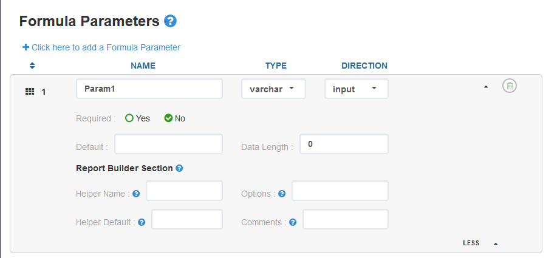
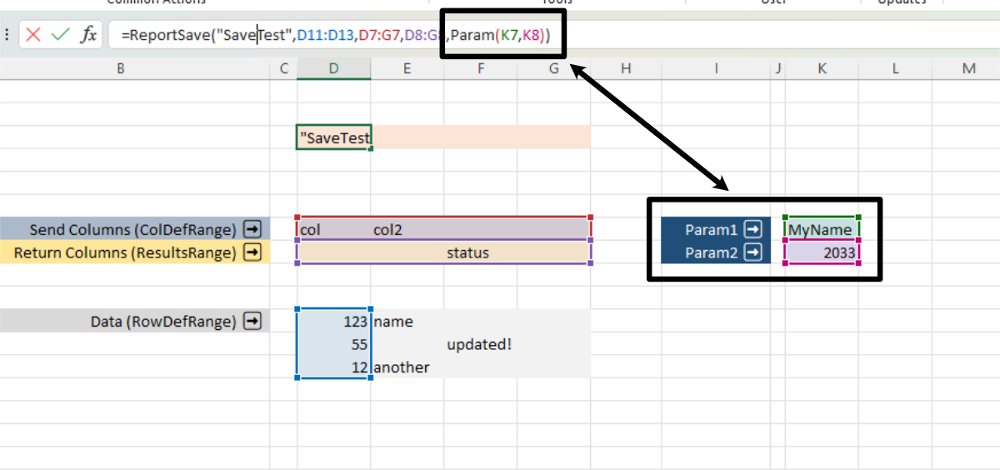
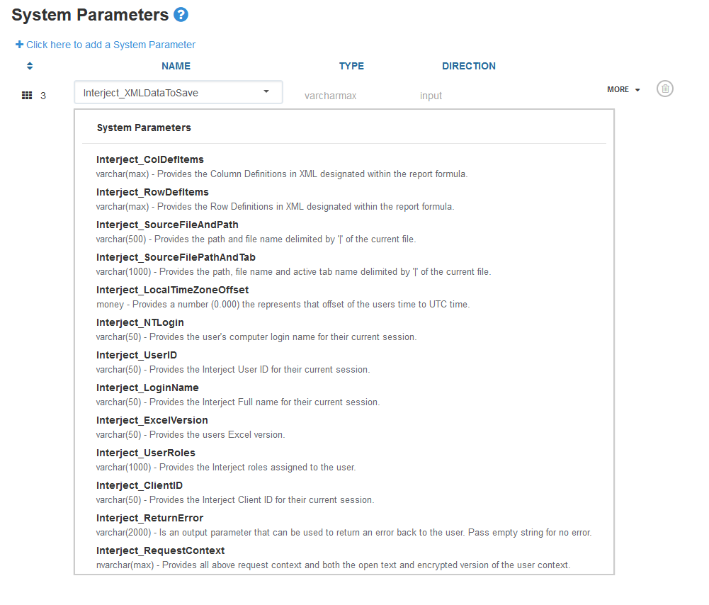

# Dataportal Parameters
Dataportal parameters allow you to get specific data inputs from the spreadsheet through Interject. There are two types of parameters: Formula and System.

## Formula Parameters
Formula parameters are defined and customized by the developers and users of Interject. They must first be set up on the [Interject Portal Site](https://portal.gointerject.com/).


<br>

To use them in the Excel Report, you must define the `Parameters` parameter in the report function:

- [ReportRange](https://docs.gointerject.com/wIndex/ReportRange.html)
- [ReportFixed](https://docs.gointerject.com/wIndex/ReportFixed.html)
- [ReportVariable](https://docs.gointerject.com/wIndex/ReportVariable.html)
- [ReportSave](https://docs.gointerject.com/wIndex/ReportSave.html)

<br>

<br>
<br>

Once the report functions are configured to use parameters, the data API code can get the values from those parameters through the `InterjectRequest` object.

```csharp
using Interject.Api;

// this request will come from the .NET Framework in the data api
InterjectResponse response = new(interjectRequest);

// get formula parameter object from request
RequestParameter param = interjectRequest.GetParameter("Param1")

// OR..... get formula parameter values from request
string reportParam1 = interjectRequest.GetParameterValue<string>("Param1");
int reportParam2 = interjectRequest.GetParameterValue<int>("Param2");
float reportParam3 = interjectRequest.GetParameterValue<float>("param3");
```
<br>

# System Paramaters

System parameters are defined by Interject but can be included in any DataPortal and will be included in the `InterjectRequest.RequestParameterList`. Once configured on the [Interject Portal Site](https://portal.gointerject.com/), they will be passed to the data API or database from Excel and can be parsed out similar to formula parameters.

<br>

<br>
<br>

Below are the system parameters and objects currently handled:

```csharp
// Currently handled getters for system parameters
InterjectRequestContext requestContext = interjectRequest.GetRequestContext();
String ntLogin = interjectRequest.GetParameterValue<string>("Interject_NTLogin");
String excelVersion = interjectRequest.GetParameterValue<string>("Interject_ExcelVersion");
String returnError = interjectRequest.GetParameterValue<string>("Interject_ReturnError");
float localTimeZoneOffset = interjectRequest.GetParameterValue<float>("Interject_LocalTimeZoneOffset");
String sourceFileAndPath = interjectRequest.GetParameterValue<string>("Interject_SourceFileAndPath");
String sourceFilePathAndTab = interjectRequest.GetParameterValue<string>("Interject_SourceFilePathAndTab");
String userID = interjectRequest.GetParameterValue<string>("Interject_UserID");
String loginName = interjectRequest.GetParameterValue<string>("Interject_LoginName");
String userRoles = interjectRequest.GetParameterValue<string>("Interject_UserRoles");
String clientID = interjectRequest.GetParameterValue<string>("Interject_ClientID");
```

<br>
The system parameter "Interject_RequestContext" will also bring a number of other objects with it that can be queried.

<br>

```csharp
// Currently handled getters for objects in the system parameter "Interject_RequestContext"
IdsTable table = interjectRequest.GetXmlDataToSave();
List<InterjectRowDefItem> rowDefItems = interjectRequest.GetRowDefItems();
List<InterjectColDefItem> colDefItems = interjectRequest.GetColDefItems();

String excelVersion = interjectRequest.GetRequestContext().ExcelVersion;
String userID = interjectRequest.GetRequestContext().UserContext.UserId;
String clientID = interjectRequest.GetRequestContext().UserContext.ClientId;
String loginName = interjectRequest.GetRequestContext().UserContext.LoginName;
String machineLoginName = interjectRequest.GetRequestContext().UserContext.MachineLoginName;
String machineName = interjectRequest.GetRequestContext().UserContext.MachineName;
String fullName = interjectRequest.GetRequestContext().UserContext.FullName;
String idsVersion = interjectRequest.GetRequestContext().IdsVersion;
String fileName = interjectRequest.GetRequestContext().FileName;
String filePath = interjectRequest.GetRequestContext().FilePath;
String tabName = interjectRequest.GetRequestContext().TabName;
String cellRange = interjectRequest.GetRequestContext().CellRange;
String sourceFunction = interjectRequest.GetRequestContext().SourceFunction;
String utcOffset = interjectRequest.GetRequestContext().UtcOffset;
```
