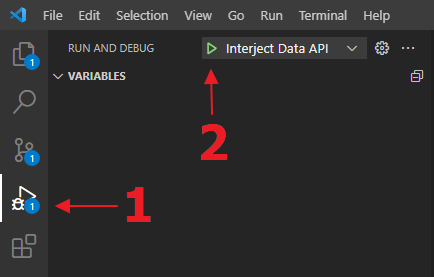

# Interject Data API (Dotnet Edition)

The Interject Data API for .Net. This API fetches data from custom sources allowing Interject to integrate data from more locations.

---

- ### **[How To Set Up the API for Development](#setup-for-dev)**
- ### **[Status controller](#status-controller)**
- ### **[How To Add A New Controller](#new-controller)**
- ### **[Settings & Configurations](#app-settings)**

 

# <a name="setup-for-dev">How To Setup the API for Development</a>

Steps: _using Visual Studio Code_

1. Clone the [repository](https://github.com/GoInterject/ids-dotnet-api) from Github.
2. You will need to install the [.Net 6 SDK](https://dotnet.microsoft.com/en-us/download/dotnet/6.0).
3. You will also need the [C# Dev Kit](https://code.visualstudio.com/docs/languages/csharp) extension for VSCode.
4. Navigate to the interject-dotnet-api directory and execute the restore command.
   > dotnet restore
5. You should now be able to now run the application. Press (Ctrl+Shift+D) or use the run and debug menu.

   

   - To run Without debugging Pres F5 or enter the command:
     > dotnet run

6. This API uses Kestrel to serve the application locally at the default base URL of http://localhost:5000. You can configure the starting port by modifying the file: `interject.data.api\interject-dotnet-api\Properties\launchSettings.json`

7. You can test by sending a request to the status controller http://localhost:5000/api/v1/status

 

# <a name="status-controller">Status Controller</a>

As an additional tool for testing and to assist in future troubleshooting of client APIs, a status controller is available. There are two endpoints:

- {base url}/api/v1/status 

   - Returns "true"

- {base url}/api/v1/status/options
   - Returns information stored in the class `ApplicationOptions` as configured in "Applications" section of the `appsettings.json`.

# <a name="new-controller">How To Add A New Controller</a>

Each controller will likely represent either a connection to a particular type of data source or a logical collection of endpoints for a series of reports. 

1. Initialize the `InterjectResponse` & `IdsTable`
2. (Optional) Get the Request parameters
3. Process the Data
4. Build the Columns & Rows
5. Add the `IdsTable` to the Response

## 1) Initialize the Interject_ResponseDTO & Interject_Table

The `InterjectResponse` is initialized using the `InterjectRequest` so that all the Request Parameters can be compied to the Response object.

The `IdsTable` is initialized as well. You may initialize it with a table name if you wish. This object will hold all the columns and rows you will add in following steps.

## 2) (Optional) Get the Request Parameters

If your Interject Request contains parameters, you can get them and store them as local objects in order to use them in your logic for fetching the data. If your Inteject Request is including data to save to your data source, you will need to get this data via the `Interject_XMLDataToSave` parameter.

To see a complete guide to Request Parameters, see the readme `portal_parameters` in the interject.data.api\Examples folder.

## 3) Process the Data

Here is where you can add your logic to process the incoming data from the Request. The `InterjectRequest` object should have everything you need to do this. You will need to fetch the data from your own source in order to store them into the Interject Table. If you are performing a save, you will need to use the data from the report sent to the API via the `Interject_XMLDataToSave` parameter.

## 4) Build the Columns & Rows

Each column in the return data needs to be built and added to the `IdsTable`. Each property is set by default but you can override any property to customize your table.

Likewise, each row of data needs to be added to the table. Interject expects the &lt;string&gt; data type so each row is simply a List of &lt;string&gt;.

## 5) Add the IdsTable To the Response

When all the data is processed and added to the InterjectTable, simply add the table to the Reponse using te `AddReturnedObject` method. This will serialize the table in order for Interject to consume it.

All that is left is to return the Reponse.

 

# <a name="app-settings">Settings & Configurations</a>

This API uses a number of classes and json files to configure and apply settings:

- `ApplicationOptions` : Class that contains the name of the data api which will let us know language and framework information. It also contains the version of the API installed to make it easier during support calls. The version correlates directly to the tag on the main branch of the repo.

- `launchSettings.json` : Contains settings relating to launching the API, including web server settings and Swagger.

- `appsettings.json` : Contains configurations for the app such as the name and version. Also contains connections strings to connect to a data source. 