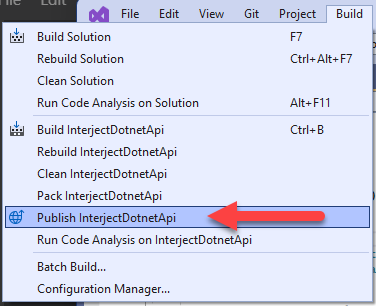
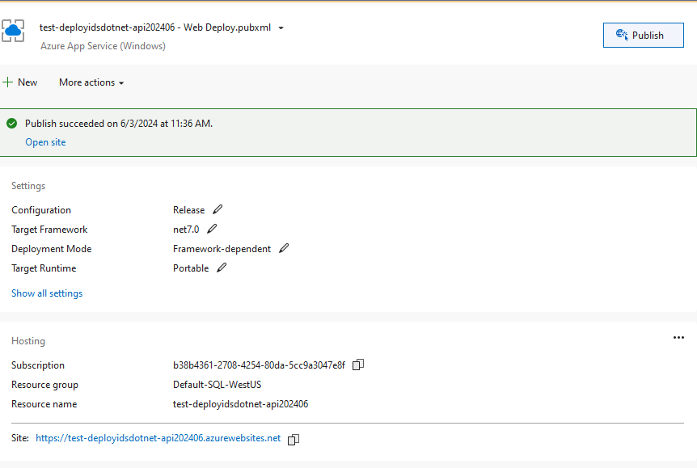
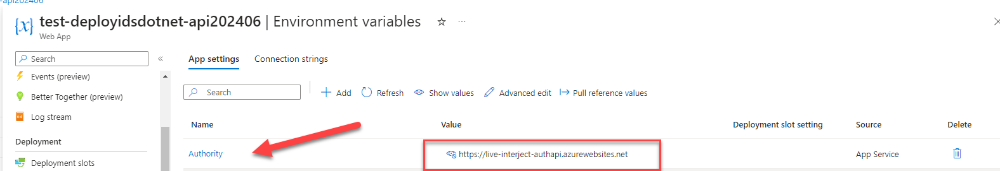
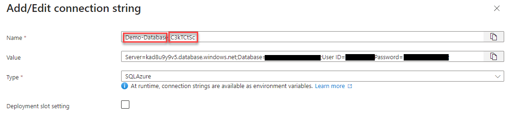
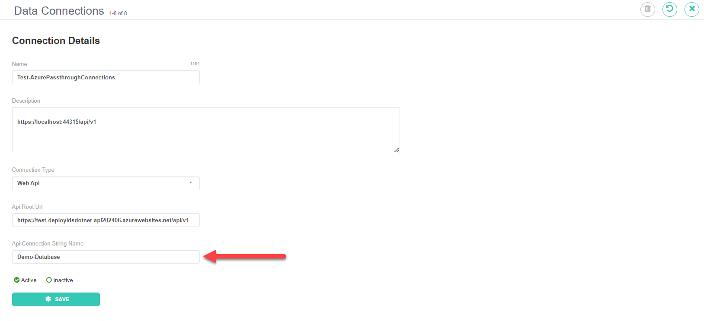
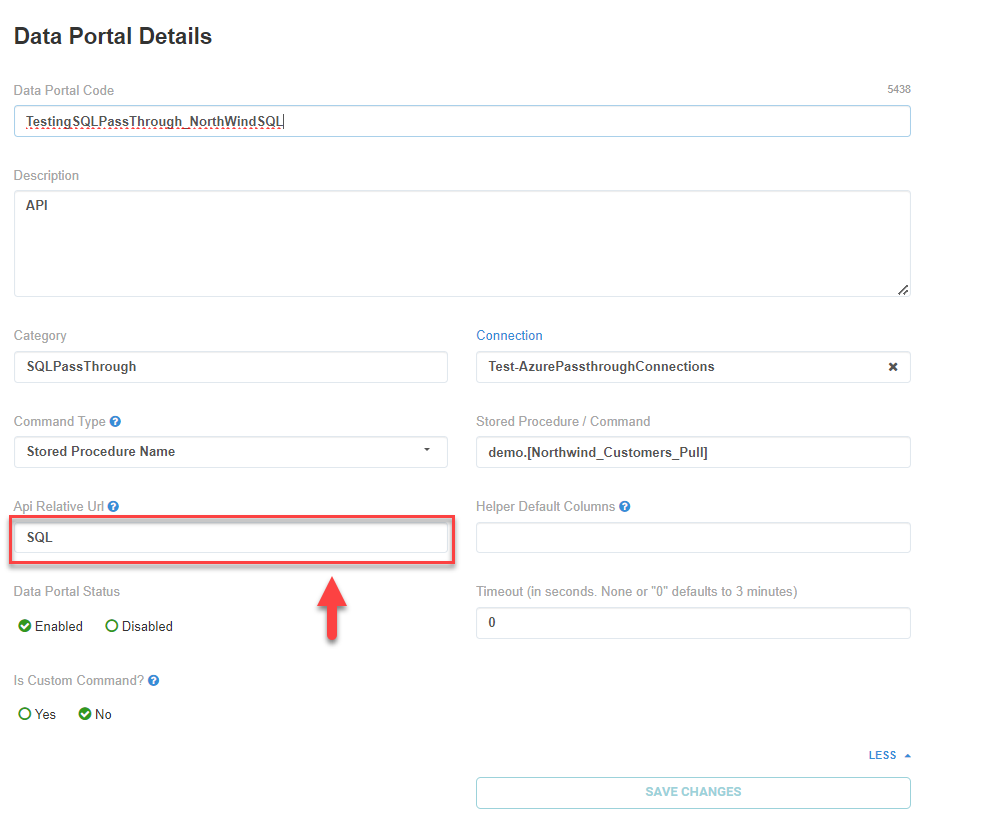

### How to deploy project using Visual Studio

1. Go to folder `./ids-dotnet-api/interject.data.api/interject.data.api/` and open project using Visual Studio `InterjectDotnetApi.csproj`
2. Build project
3. Publish Project
   
4. Add configuration to Azure
   
5. Setup App setting in Azure
   - Name: Authority
   - Value: https://live-interject-authapi.azurewebsites.net
     
6. Add connection strings using the following
   - Add connection Name: `{ConnectionName}_{ClientPublicID}`
   - Connection String:
     
7. Reset site to include changes made to connection strings and web app settings.
8. Confirm that site is up may need to start the site
   https://{subUrl}.azurewebsites.net/api/v1/status

### How to setup data connection in Interject dataportal site

1. In the portal site setup connetion to match config Connection String:
   
2. Create a Data Port:
   
